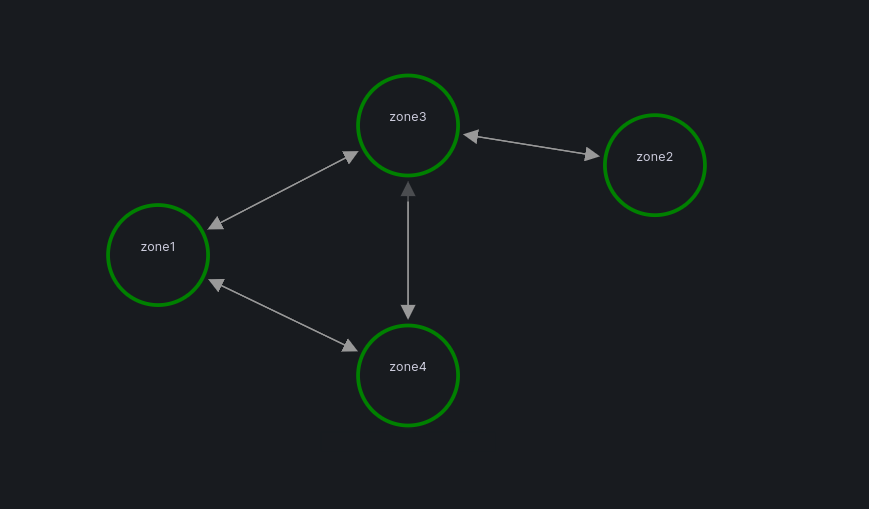
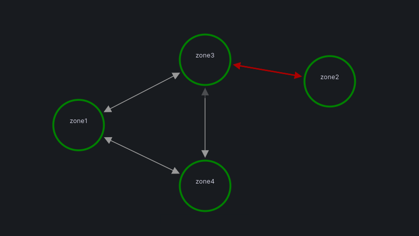

# zone reachability observer
<div style="margin: 0; padding: 0; display: flex; justify-content: center; align-items: center; height: 40vh;">


</div><br/>
The ZoneReachabilityObserver lets you easily Visualize and Monitor the connections between different zones (subnets) in your network without generating any extra traffic such as icmp, ... .
This repository incorporates ebpf, <a href="https://github.com/cloudflare/ebpf_exporter">ebpf_exporter</a>, and grafana to provide a clear insight into zone reachability.

## Installation
0 - create zone config file according to zmon.cfg
```
Just specify some servers for each zone
```
1 - python generator.py
```
  Copy the printed job configs to scrape_configs section of prometheus.yaml file
```
2 - make
```
  required tools like clang,llvm,libbpf-dev,... must be present on the machine
```
3 - ansible-playbook -i hosts deploy.yml --ask-become-pass
```
  edit generated hosts file and run ansible playbook
```
4 - add zone_reachability_observer dashboard to grafana
```
  ZoneReachabilityChecker-1704785047383.json
  click on edges
```

## demo
0 - cd demo</br>
1 - vagrant up
```
  KVM , Vagrant and Vagrant libvirt plugin must be added beforehand    
```
2 - add zone_reachability_observer dashboard to grafana
```
  default grafana address : 192.168.50.2:3000
  config prometheus datasource(http://localhost:9090)
  ZoneReachabilityChecker-1704785047383.json
  click on edges
```
